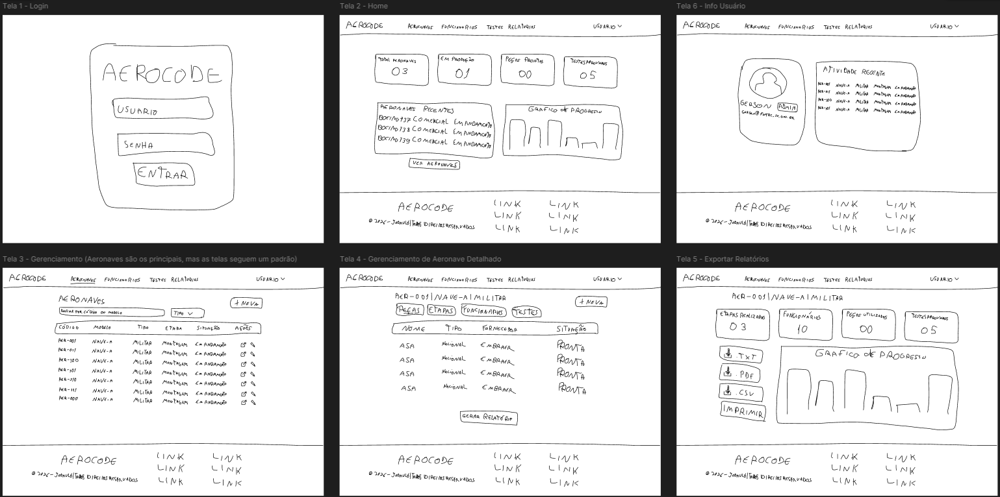
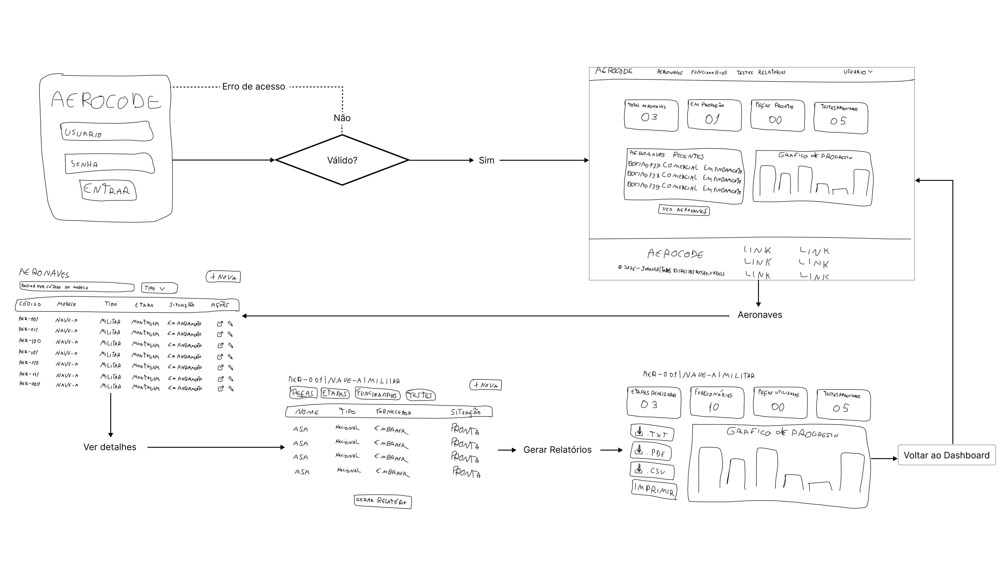

# Relatório de Planejamento de Interface (GUI)
## Projeto AV2 - Desenvolvimento Front-end com React

### 1. Introdução e Objetivos
Este documento apresenta o planejamento estrutural da Interface Gráfica de Usuário (GUI) para o projeto AV2. O objetivo fundamental é estabelecer as bases da organização do conteúdo e das funcionalidades antes da implementação técnica em React. Através da criação de wireframes, buscamos alinhar a arquitetura da informação com as necessidades dos usuários, garantindo uma navegação intuitiva e eficiente.

### 2. Público-Alvo e Entendimento do Projeto
O projeto destina-se a usuários que necessitam de uma interface web performática e modular. Dado que a aplicação será executada em ambientes como Windows e Linux (Ubuntu), a interface foi planejada para ser responsiva e adaptável.

**Objetivos principais:**
* Proporcionar uma experiência de usuário (UX) fluida e sem ruídos visuais.
* Garantir a escalabilidade do código através da componentização proposta pelo React.
* Facilitar a manutenção futura através de uma hierarquia clara de informações.

---

### 3. Wireframe de Baixa Fidelidade
Abaixo, apresenta-se o esboço estrutural (*low-fidelity*). Nesta etapa, o foco é exclusivamente na disposição dos elementos, como menus, áreas de conteúdo e botões, utilizando formas geométricas simples para evitar distrações com o design estético final.

*Figura 1. Wireframe de baixa qualidade detalhando o layout básico.*

---

### 4. Fluxo de Navegação (User Flow)
O wireframe de fluxo de usuário demonstra a sequência de interações e o caminho que o usuário percorre dentro do sistema. Cada tela rascunhada está conectada por transições que representam as ações do usuário, permitindo visualizar a lógica do sistema de ponta a ponta.

*Figura 2. Wireframe do fluxo de usuário e conexões entre telas.*

> **Nota:** As imagens em alta resolução estão disponíveis no diretório `/docs` deste repositório além de estarem no protótipo no Figma.

---

### 5. Hierarquia de Informações e Elementos
A organização dos componentes foi pensada para priorizar as ações principais no centro e topo da visão do usuário. Elementos de navegação secundários e metadados foram alocados em áreas periféricas, garantindo que o foco permaneça na funcionalidade central da aplicação, respeitando a modularidade oferecida pelos componentes React.